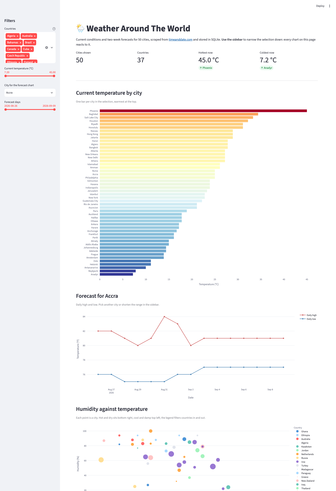

# Weather Around The World

Scrapes current conditions and 14-day forecasts for cities worldwide from
[timeanddate.com/weather](https://www.timeanddate.com/weather/), cleans the data with
pandas, and stores it as CSV. Capstone project for Code the Dream Python 100.

## Setup

```bash
python3 -m venv .venv
source .venv/bin/activate
pip install -r requirements.txt          # dashboard: streamlit, pandas, plotly
pip install -r requirements-scrape.txt   # adds selenium for the scraper
```

The dependencies are split because Streamlit Community Cloud installs
`requirements.txt` on every deploy, and the deployed dashboard never scrapes.
Only the scraper needs Chrome installed; the matching driver is downloaded
automatically.

## Usage

```bash
python scrape_weather.py     # writes data/raw/*.csv        (~8 min for 50 cities)
python clean_weather.py      # writes data/processed/*.csv
```

Scrape fewer cities while testing:

```bash
CITY_LIMIT=5 python scrape_weather.py
```

Both scripts log every step with elapsed time.

## Data

`data/processed/cities.csv` — one row per city, current conditions.

| Column | Notes |
| --- | --- |
| `city`, `country`, `url`, `location` | `location` is the reporting station |
| `temp_f`, `temp_c`, `feels_like_f` | |
| `condition` | e.g. `Passing clouds.` |
| `forecast_high_f`, `forecast_low_f` | today's range |
| `wind_mph`, `wind_from` | `wind_from` is a compass name |
| `humidity_pct`, `pressure_hg`, `visibility_mi`, `dew_point_f` | `NaN` where the station reports `N/A` |
| `current_time_local`, `latest_report_local`, `scraped_at` | |

`data/processed/forecast.csv` — one row per city per day, ~15 days ahead.

| Column | Notes |
| --- | --- |
| `city`, `country`, `forecast_date`, `day_of_week` | |
| `temp_high_f`, `temp_low_f`, `temp_high_c`, `temp_low_c`, `temp_range_f` | |
| `condition`, `feels_like_f` | |
| `wind_mph`, `wind_bearing_deg`, `wind_from` | bearing in degrees, 0 = North |
| `humidity_pct`, `precip_chance_pct`, `precip_amount_in` | |
| `uv_index`, `uv_category` | split from `7 (High)` |
| `sunrise`, `sunset`, `scraped_at` | |

`data/raw/` holds the unparsed values (`"82 / 76 °F"`, `"89%"`) so the cleaning step is
reproducible and auditable.

## Database

```bash
python load_weather_db.py      # writes data/weather.db from data/processed/*.csv
```

Two tables, one per CSV. The city and the country appear once per city instead
of once per row: `cities` holds them, and every forecast row points back through
`city_id`.

| Table | Key columns |
| --- | --- |
| `cities` | `city_id` primary key, `UNIQUE (city, country)` |
| `forecast` | `city_id` foreign key, `UNIQUE (city_id, forecast_date)` |

```sql
SELECT cities.city, cities.country, forecast.forecast_date, forecast.temp_high_f
FROM forecast
JOIN cities ON forecast.city_id = cities.city_id
ORDER BY forecast.temp_high_f DESC
LIMIT 5;
```

Two indexes are created for the way the data is read: `forecast (forecast_date)`
for one date across all cities, and `cities (country)` for one country. Lookups
by `city_id` need no index of their own - the `UNIQUE (city_id, forecast_date)`
index already starts with that column.

The loader also prints three summaries built with SQL rather than Pandas: the
five hottest days, the forecast grouped by country, and the hottest day of each
city ranked with a window function.

Each run reloads the current snapshot, so the database always matches the CSVs.
The file itself is git ignored - rebuild it with the command above.

## Dashboard

**Live app:** https://weather-around-the-world-vocqhsyk7x4y9mfhmr89sc.streamlit.app/

Run it locally with:

```bash
streamlit run streamlit_app.py
```



Four charts over the database, all reacting to the filters in the sidebar:

| Chart | Question it answers |
| --- | --- |
| Current temperature by city | where is it hot right now |
| Forecast for one city | how the next two weeks look |
| Humidity against temperature | which cities are hot and dry, which are cool and damp |
| Chance of precipitation, city by day | where and when rain is expected |

The sidebar filters by country and by current temperature, picks the city for
the forecast chart, and narrows the forecast date range. A headline row shows
how many cities and countries are in the selection, with the hottest and
coldest of them.

The database is not in git, so on a fresh checkout the app rebuilds it from
`data/processed/*.csv` the first time it loads - which is exactly what happens
on Streamlit Community Cloud.

## Scraping policy

`timeanddate.com/robots.txt` allows `/weather/`. The disallowed paths
(`/weather/*?hd=*`, `/weather/*/historic?hd=*`, `/weather/*/hourly?hd=*`,
`/weather/*sort*`) are not used. The scraper pauses 2 seconds between requests, reads the
city list in a single request rather than one per city, and runs on demand only.

## Roadmap

- [x] Week 1 — scraping and data cleaning
- [x] Week 2 — load into SQLite
- [x] Week 3 — Streamlit dashboard

